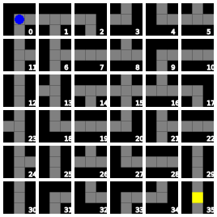

# Labyrinth PDDL Domain

This domain is inspired by the Ravensburger
[Labyrinth](<https://en.wikipedia.org/wiki/Labyrinth_(board_game)>) board game.
The goal is to guide a robot through a dynamically changing labyrinth.
The labyrinth consists of N times N cards forming a square board and each
card consists of four corner sectors that may or may not have a horizontal
or verical wall put between them. The robot can freely move between sectors
and between adjecent cards as long as it does not cross a wall. The
labyrinth can be changed by pushing a row or column of cards so that the
card pushed out of the board is put back at the other side of the board.
In this way, it is possible to change the layout of the labyrinth so that
the robot can move through it to find its way out.
The robot always starts in the top left corner, and is allowed to leave
the labyrinth once it reaches the bottom right corner. The row or column of
cards can be pushed only if the robot is not occupying any card in that row or
column.

Example of a labyrinth (in its initial state):

Possible plan:

This domain was submitted to International Planning Competition 2023 by
 - Rebecca Eifler <eifler@cs.uni-saarland.de>, and
 - Daniel Fišer <danfis@danfis.cz>

The PDDL domain file and the problem generator has been dedicated to the
[public domain](https://en.wikipedia.org/wiki/Public_domain) by the authors.
